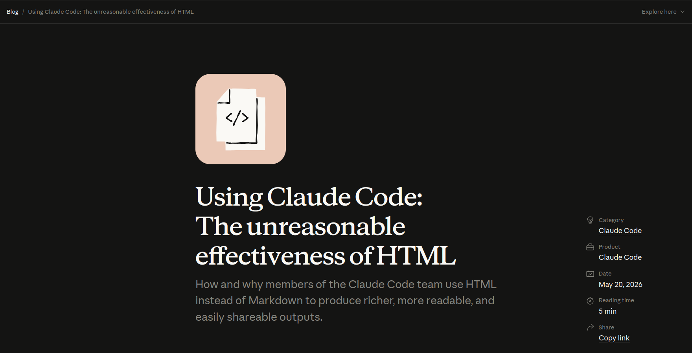

# Why Is Software Documentation Still Static – And Why Modern Browsers Deserve Better

*André Dietrich -- TU Bergakademie Freiberg*

<!-- style="width: 100%" -->

> [!NOTE]
> This presentation is authored in LiaScript — the format under discussion.
> You are looking at the source at: https://github.com/andre-dietrich/We-Are-Developers-2026
>
> Open it at [liascript.github.io/course](https://liascript.github.io/course/?https://raw.githubusercontent.com/andre-dietrich/We-Are-Developers-2026/refs/heads/main/README.md) to run it live.


## The Unreasonable Effectiveness of HTML




## The Problem: Documentation Optimized for Publishing

__The Publishing Pipeline__

``` ascii
.--------------.   .--------------.   .-------------.   .-------------.   .--------------.
|   Markdown   +-->|  build step  +-->| static HTML +-->|     CDN     +-->|    reader    |
'--------------'   '--------------'   '-------------'   '-------------'   '-------+------'
       A                                                                          |
       |                         (publishing loop)                                |
       +--------------------------------------------------------------------------+
```

---

__How Developers Actually Use Documentation__

``` ascii
 .------.       .-----.       .--------.       .---------.       .-------.       .-------.
(  read  )<--->(  run  )<--->(  modify  )<--->(  observe  )<--->(  debug  )<--->(  share  )
 '------'       '-----'       '--------'       '---------'       '-------'       '-------'
     A                                                                               A
     |                                                                               |
     '-------------------------------------------------------------------------------'
```

### Example: Before AI There Was AI


Example: https://github.com/tensorflow/tfjs

## Mental Model Shift: Browser as Runtime

|                  | Old mental model        | New mental model                      |
|------------------|-------------------------|---------------------------------------|
| **Markdown**     | Source for a build step | Source for a browser runtime          |
| **Browser**      | A display device        | A full application runtime            |
| **Code runs**    | In CI, at build time    | In the reader's browser, at read time |
| **Output lives** | In the repository       | In the live document                  |


## In A Perfect World

...


## LiaScript - Resources

* __Project-Website:__ https://LiaScript.github.io
* __GitHub:__ https://github.com/liascript
* __YouTube:__ https://www.youtube.com/channel/UCyiTe2GkW_u05HSdvUblGYg
* __Additional resources:__

  - Documentation: https://github.com/LiaScript/docs
  - Free books: https://github.com/LiaBooks
  - Templates: https://github.com/topics/liascript-template
  - Courses & ...: https://github.com/topics/liascript-course
